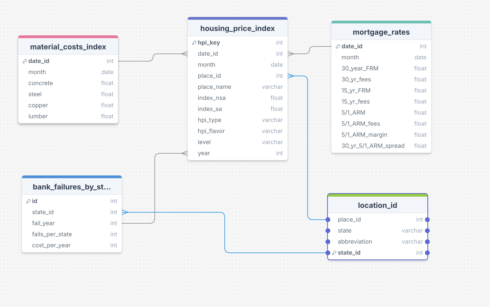

# U.S. Housing Market Relational Database

A relational database and ETL pipeline integrating U.S. housing prices, mortgage rates, construction material costs, and bank failures using Python, Pandas, PostgreSQL, SQL, and AWS.

The project transforms several independently structured economic datasets into a common relational model, allowing housing-market indicators to be queried and compared across time and geography.

## Project Overview

U.S. housing-market data are distributed across multiple federal and economic data sources with different formats, frequencies, and geographic structures.

This project builds an ETL pipeline that:

- Extracts data from multiple public datasets
- Cleans and standardizes dates and geographic identifiers
- Converts weekly mortgage-rate data to monthly observations
- Rebases construction material indexes to a common January 1991 baseline
- Aggregates bank failures by state and year
- Creates shared date and geographic identifiers
- Structures the transformed data for a PostgreSQL relational database
- Uses SQL joins and queries to analyze relationships across datasets

The original implementation used AWS S3 for source-data storage and PostgreSQL hosted on AWS RDS. The repository preserves the ETL workflow, relational schema, and SQL analysis without requiring access to the original cloud infrastructure.

## Database Schema


The schema reflects the original PostgreSQL implementation; minor column names were standardized in the portfolio version for clarity and consistency.

The database integrates five primary tables:

- `housing_price_index` — monthly FHFA Housing Price Index observations
- `mortgage_rates` — monthly aggregated mortgage-rate data
- `material_costs_index` — standardized concrete, steel, copper, and lumber price indexes
- `bank_failures_by_state` — annual bank failures aggregated by state
- `location_id` — geographic lookup connecting states with Census divisions

Shared date and geographic identifiers allow data from otherwise independent sources to be queried together.

## ETL Pipeline

### Extract

Raw data are obtained from public economic and federal data sources and loaded into Pandas DataFrames.

### Transform

The transformation pipeline standardizes the datasets before database loading.

Key transformations include:

- Converting inconsistent date formats to datetime values
- Filtering the analysis period to 1991 onward
- Creating monthly date identifiers
- Mapping states to Census divisions
- Rebasing construction material indexes to January 1991 = 100
- Converting weekly mortgage-rate observations to monthly averages
- Aggregating bank failures by state and year
- Preparing FHFA Housing Price Index observations for relational storage

### Load

The original project loaded the transformed tables into PostgreSQL hosted on AWS RDS using `psycopg2`.

The database-loading implementation is retained in the analysis notebook as a reproducibility example, with credentials replaced by environment variables.

## SQL Analysis

The relational structure supports both individual-table summaries and cross-table analysis.

Example questions include:

- How has the average Housing Price Index changed over time?
- What were the highest and lowest observed mortgage rates?
- Which states experienced the most bank failures during the financial crisis?
- What were mortgage rates when construction material costs were lowest?
- How can housing prices, mortgage rates, and construction costs be compared for the same time period?
- How do Census-division housing prices relate to bank failures within their member states?

Example SQL queries are available in [`sql/analysis_queries.sql`](sql/analysis_queries.sql).

The PostgreSQL table definitions are available in [`sql/schema.sql`](sql/schema.sql).

## Repository Structure

```text
housing-market-rdb/
│
├── analysis/
│   └── housing_index_etl.ipynb
│
├── data/
│   ├── bank_failures.csv
│   ├── concrete.csv
│   ├── copper.csv
│   ├── hpi_master.csv
│   ├── lumber.csv
│   ├── mortgage_rates.xlsx
│   └── steel.csv
│
├── docs/
│   └── schema.png
│
├── sql/
│   ├── analysis_queries.sql
│   └── schema.sql
│
├── .gitignore
└── README.md
```

## Data Sources

Data used in this project were obtained from:

- **Federal Housing Finance Agency (FHFA)** — Housing Price Index
- **Federal Deposit Insurance Corporation (FDIC)** — Bank failure data
- **Freddie Mac** — Primary Mortgage Market Survey
- **Federal Reserve Economic Data (FRED)** — Construction material price indexes

The raw datasets used by the reproducible pipeline are included in the `data/` directory.

## Technologies

- Python
- Pandas
- NumPy
- PostgreSQL
- SQL
- psycopg2
- Jupyter
- AWS S3
- AWS RDS

## Analysis Notebook

The complete ETL workflow, transformations, database-loading logic, and project documentation are contained in:

[`analysis/housing_index_etl.ipynb`](analysis/housing_index_etl.ipynb)

## Project Purpose

This project demonstrates the construction of an end-to-end data pipeline from heterogeneous public datasets to a normalized relational database.

The primary focus is data engineering and relational database design: transforming independently structured datasets into consistent tables that can be joined and queried for housing-market analysis.
